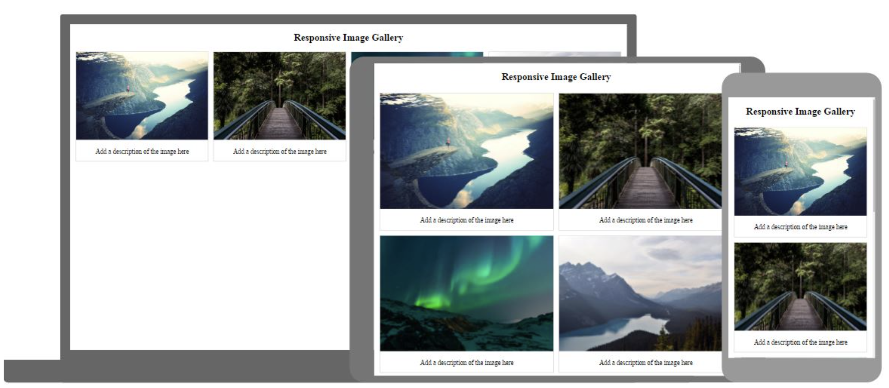

# Responsive Image Gallery — CSS Flexbox William Hernández

Galería de imágenes responsive construida con **HTML5 y CSS3 Flexbox**.

## 🔗 Github Pages

👉 [Ver en GitHub Pages](https://wfhgdev.github.io/BootCampWebF5-ImagesGalleryFlex/)


## 📁 Estructura de archivos

```
├── index.html
├── index.css
├── README.md
└── images/
```
## 📝 Diseño referencia




## ✅ Requisitos cumplidos

- [x] Mínimo 8 imágenes
- [x] Responsive: Mobile / Tablet / Desktop
- [x] CSS Flexbox (`display: flex`, `flex-wrap`, `flex`, `gap`)
- [x] Estructura simple: `index.html` + `index.css` + `images/`